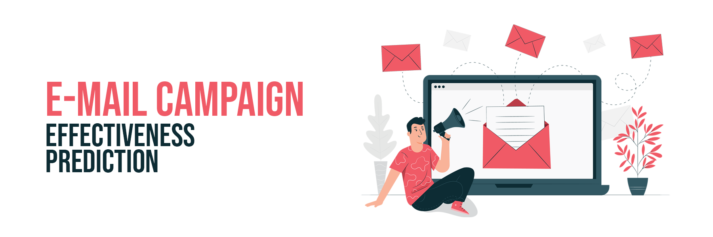
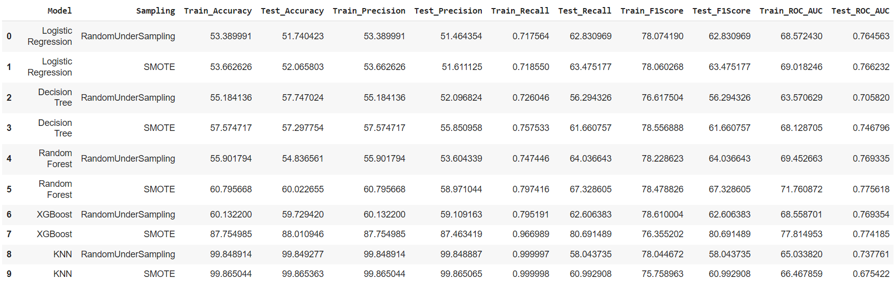
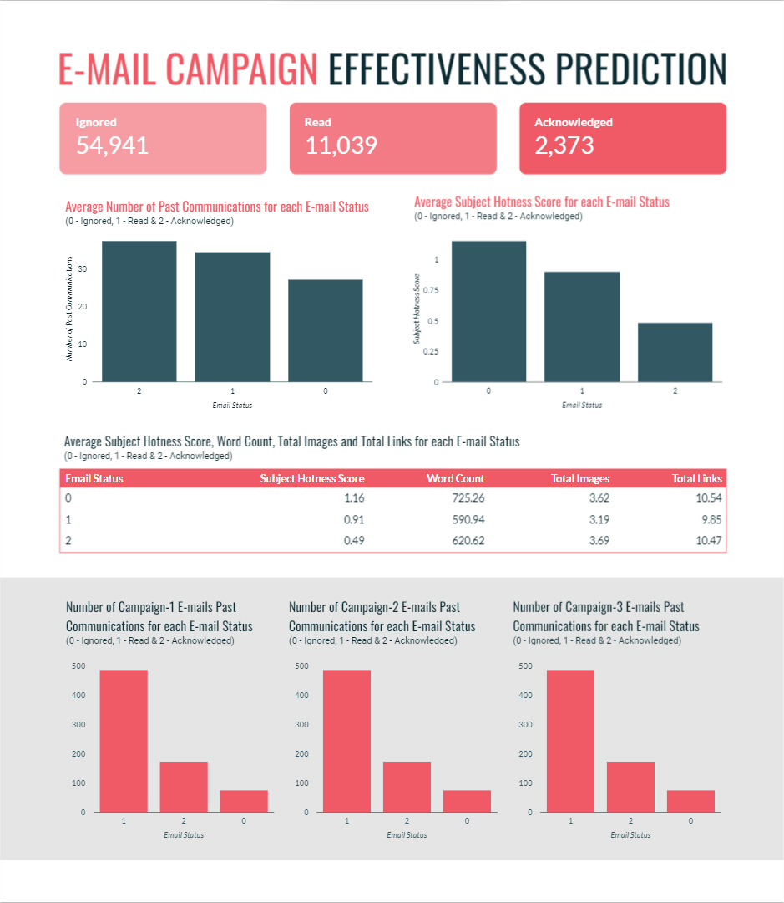

 
  

In this project, I have attempted to analyze the data on e-mail marketing campaign and build a machine learning model to predict the mail that is ignored, read, or acknowledged by the reader. No personal information of recipient is provided in this dataset.

## :floppy_disk: Project Files Description</h2>

This project contains an executable iPython Notebook, a presentation and source as follows:

<h4>Executable Files:</h4>
<ul>
  <li><b>Email_Campaign_Effectiveness_Prediction_Capstone_Project.ipynb</b> - Google Colab notebook containing data summary, exploration, visualisations, feature engineering, modelling, performance evaluation and conclusion.</li>
</ul>

<h4>Documentation:</h4>
<ul>
  <li><b>Presentation PDF - Supervised Machine Learning - Classification - Email Campaign Effectiveness Prediction - Capstone Project.pdf</b> - Presentation slideshow of the project.</li>
</ul>

<h4>Source Directory:</h4>
<ul>
  <li><b>data_email_campaign.csv</b> - Includes e-mail marketing campaign data.</li>
</ul>

## :book: Problem Statement

Most of the small to medium business owners are making effective use of Gmail-based e-mail marketing strategies for offline targeting of converting their prospective customers into leads so that they stay with them in business.
The main objective is to create a machine learning model to characterize the mail and track the mail that is ignored; read; acknowledged by the reader.

## :book: Approach

1.	Understanding the business task.
2.	Import relevant libraries and define useful functions.
3.	Reading data from files given.
4.	Data pre-processing, which involves inspection of both datasets and data cleaning.
5.	Exploratory data analysis, to find which factors affect sales and how they affect it.
6.	Feature engineering, to prepare data for modelling.
7.	Modelling data and comparing the models to find out most suitable one for classification.
8.	Conclusion.

## :book: Exploratory Data Analysis

The following insights were gained from EDA:
<li>No e-mails of campaign type 1 got ignored.</li>
<li>If campaign type is 1, then the mail has 66% chance of getting read and 23% change of getting acknowledged.</li>
<li>Customer location or time of day does not affect the status of e-mail.</li>
<li>As the number of previous communication increases, the chances of the e-mail being read or acknowledged also increases.</li>
<li>E-mails tend to get ignored when word count is greater than 800.</li>

## :book: Exploratory Data Analysis

<li>Campaign 1 is more successful than other campaigns. So it is wise to continue Campaign 1 and discontinue others.</li>
<li>Increase customer interactions to get more results.</li>
<li>Limit word count to less than 800.</li>

## :book: Modelling

### 📊 Data Visualization

An interactive dashboard was also created with Tableau to display charts associated with the analysis.

Click [here](https://lookerstudio.google.com/reporting/989c4fc2-64ec-402f-bdb4-c92d7d8bd57a) to interact with the data visualization.

## 📘: Conclusion

The following conclusions were drawn from Modelling:
<li>Oversampled data seems to be better than undersampled data. This can be due to the fact that undersampling causes loss of information.</li>
<li>The model built using XGBoost algorithm with SMOTE dataset performed better than the other models. It should be preferred for predicting mail statuses.</li>
<li>If model interpretability is more important than accuracy, model built using logistic regression algorithm and SMOTE dataset should be chosen over the one using XGBoost algorithm. It is the best performer among the white box models.</li>

## :scroll: Credits

Midhun R | Avid Learner | Data Analyst | Data Scientist | Machine Learning Enthusiast

 <i> Contact me for Data Science Project Collaborations</i>

## :books: References
<ul>
  <li>
Towards Data Science, 'Having an Imbalanced Dataset? Here Is How You Can Fix It.'. [Online].

      
Available: https://towardsdatascience.com/having-an-imbalanced-dataset-here-is-how-you-can-solve-it-1640568947eb/

  </li>
  <li>
Machine Learning Mastery, 'Multinomial Logistic Regression With Python'. [Online].

      
Available: https://machinelearningmastery.com/multinomial-logistic-regression-with-python/

  </li>
  <li>
Kaggle, 'How to Choose Right Metric for Evaluating ML Model'. [Online].

      
Available: https://www.kaggle.com/code/vipulgandhi/how-to-choose-right-metric-for-evaluating-ml-model/

  </li>
</ul>

<a href="https://www.freepik.com/free-vector/email-campaign-concept-illustration_7367537.htm#query=email&position=0&from_view=search&track=sph">Image by storyset</a> on Freepik
